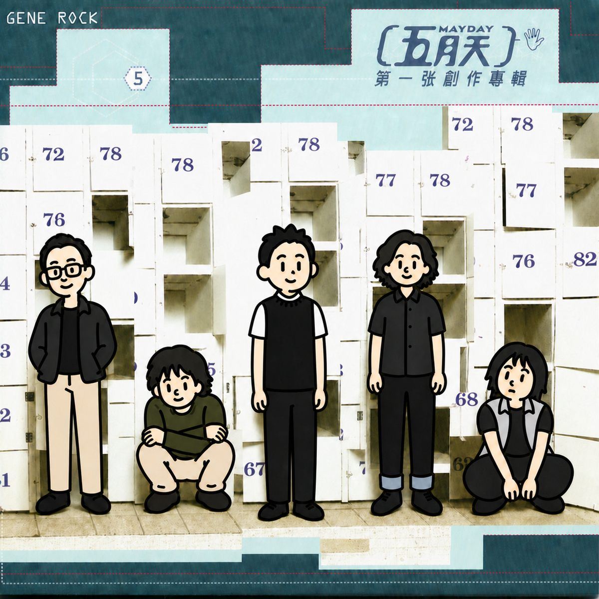
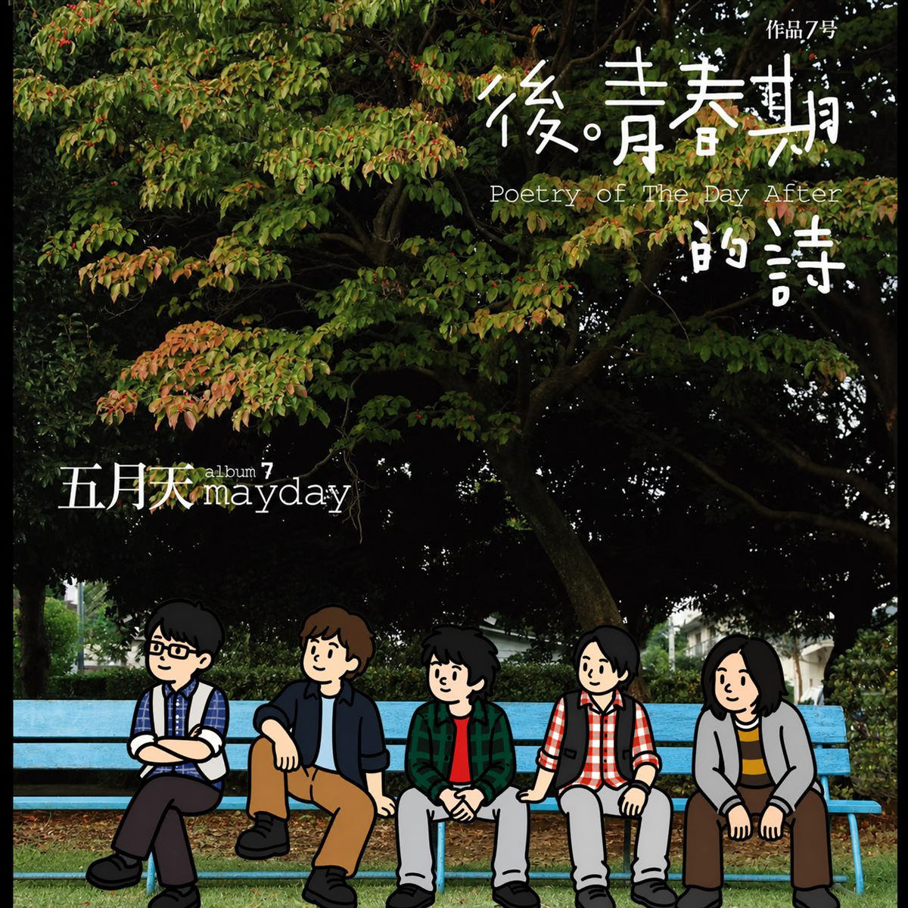
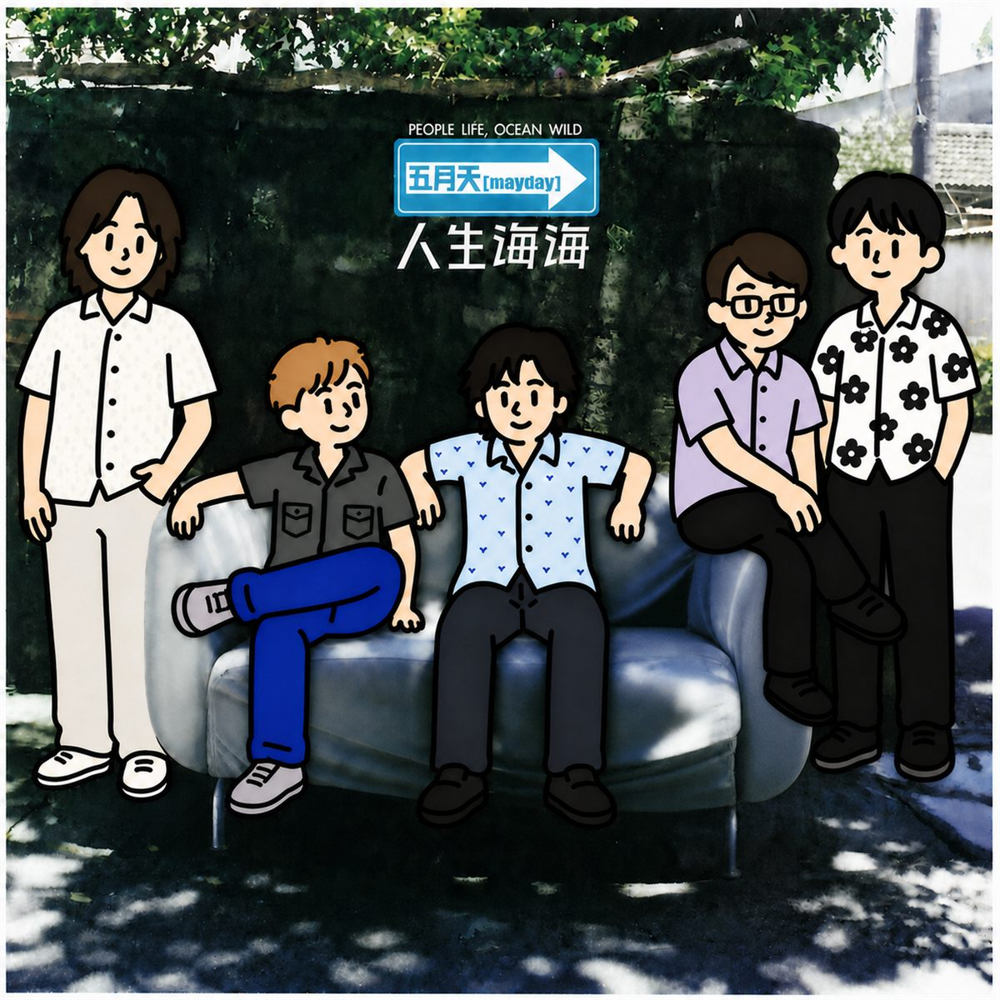
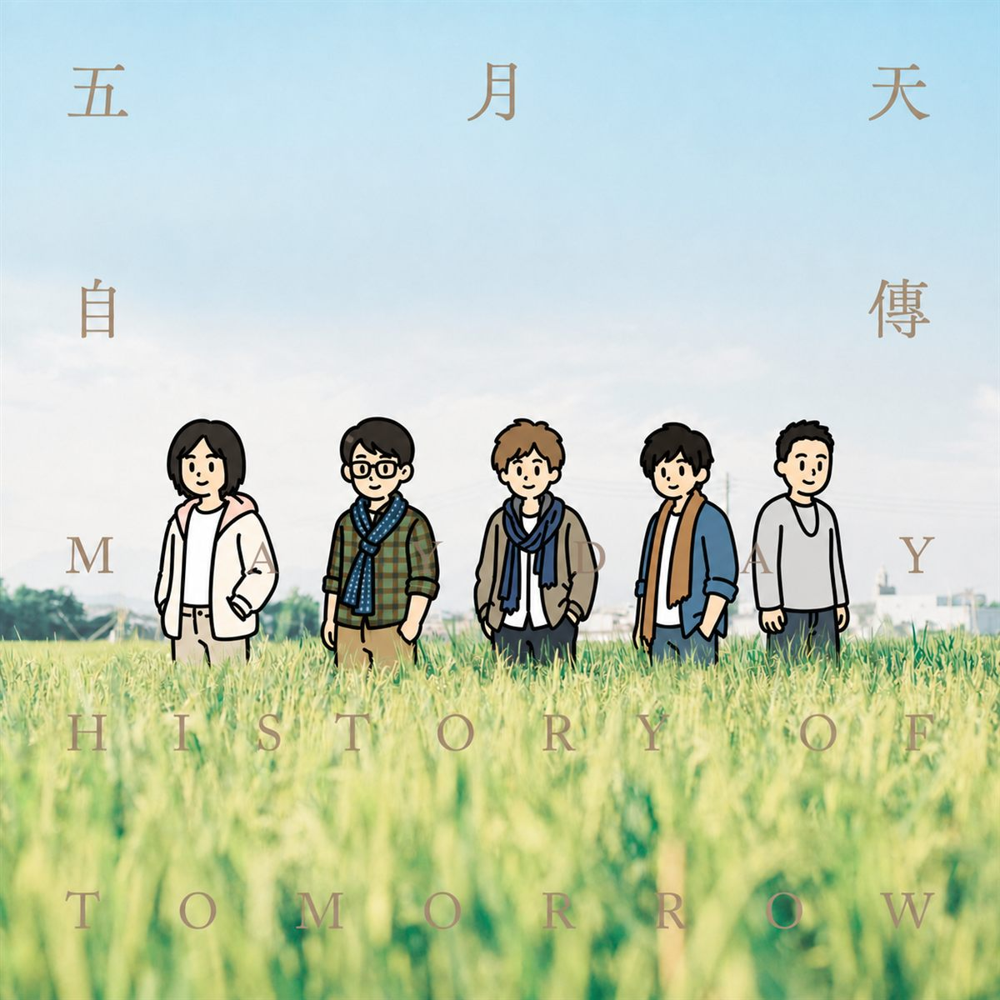

# Style Migration Workflow

一个用于“把目标图内容迁移到指定视觉风格中”的 Codex Skill。

它重点解决的不是单次提示词生成，而是一套可复用的工作流：先把目标图中的主体、空间关系和关键特征分析清楚，再选择风格和生成模式，最后用局部返修或图层合成稳定结果。

## 主要功能

- **内容与风格分离**：目标图决定画谁、位置、姿态、构图和关键特征；风格参考只决定画法，不继承参考图里的角色、文字、Logo 或道具。
- **三种迁移模式**：
  - **模式A：仅主体生成**：只生成指定人物、动物或物件，背景使用白底或纯色。
  - **模式B：主体加风格化场景**：把主体和背景整体转成同一种画风。
  - **模式C：主体加真实场景**：保留真实背景，移除原主体，把风格化主体像拼贴一样放回真实场景。
- **多人/多物体编号管理**：为每个主体固定编号，记录位置、姿态、遮挡、接地线、相对大小和关键特征，后续修改时持续沿用。
- **生成前确认门禁**：在风格、模式、关键保留特征未确认前，不进入生成，避免“先做了再说”导致方向跑偏。
- **局部返修模块**：支持只改指定主体、接地/贴合修复、相对大小修正、头部不变身体调整、原主体残留修复等。
- **模式C图层合成流程**：当主体素材已经确认后，优先用固定图层合成，而不是反复整图重画，减少人物漂移。

## 目录结构

```text
.
├── SKILL.md
├── README.md
├── example/
├── references/
│   ├── workflow-blocks.md
│   ├── repair-blocks.md
│   ├── scripts/
│   │   ├── README.md
│   │   ├── layer_composite.py
│   │   └── make_character_sheet.py
│   └── styles/
│       ├── style-1-marker-doodle/
│       └── style-2-watercolor/
└── output/              # 本地输出目录，不上传 GitHub
```

## 内置风格

### Style 1：圆拙断线粗马克笔

极简、圆拙、童趣的粗马克笔涂鸦风格。特点是粗黑结构线、Q版比例、干净实心平涂、少量手绘断口，适合做可爱人物、物件、角色表或拼贴主体。

该风格还包含 `reference.png` 和 `notes.md`，可作为额外的视觉风格参考和边界说明。

### Style 2：轻水彩手绘

轻盈、柔和、手绘感的水彩风格。适合把照片或场景转成温和插画、旅行速写、生活记录类画面。它允许柔和晕染和留白，但仍要求主体结构、五官、手部和空间关系清晰。

## 使用流程

1. 用户提供目标图，并说明想要的结果。
2. 选择或确认一个风格，例如 `style-1-marker-doodle` 或 `style-2-watercolor`。
3. 选择或确认模式A、模式B、模式C。
4. 明确关键保留特征，例如发型、眼镜、服装图案、宠物花色、特殊道具等；如果没有，也需要明确说没有特殊保留要求。
5. Skill 建立主体地图，并根据模式读取对应的 workflow 模块。
6. 生成初稿或主体素材。
7. 根据反馈使用 repair 模块做局部返修。
8. 对模式C，在主体确认后优先使用图层合成脚本完成最终图。

## 辅助脚本

`references/scripts/` 中包含两个模式C辅助脚本：

- `make_character_sheet.py`：把多个已确认主体素材按编号排成角色表，方便确认和后续引用。
- `layer_composite.py`：根据 placement CSV，把固定主体图层合成到干净背景底板上，并可输出带图层框的核对稿。

这些脚本只负责执行图层合成，不定义画风，也不替代主体地图和用户确认。

## 效果示例

以下图片放在 `example/` 目录中，可作为该 workflow 的输出效果参考。









## 注意事项

- `output/` 是本地生成输出目录，已写入 `.gitignore`，不会上传到 GitHub。
- 参考图只决定风格，不决定画面内容。
- 目标图决定主体数量、姿态、位置、遮挡、接地和相对大小。
- 用户确认过的主体或构图应被锁定，后续只修改点名的问题。
